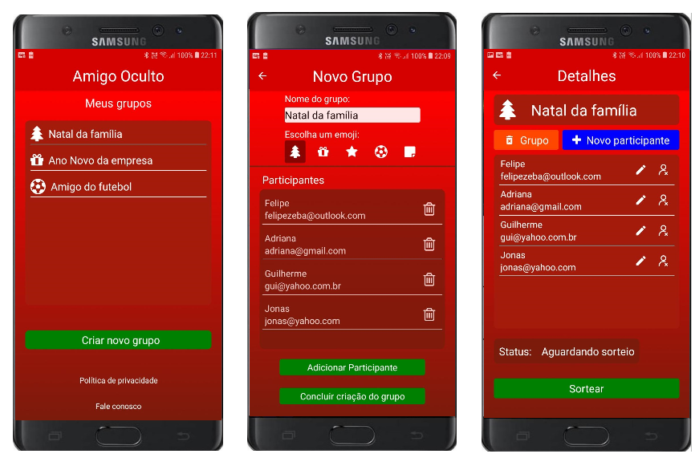

<h1 align="center">
    
</h1>

<h4 align="center">
   Secret Santa
</h4>

  <a href="#-projeto">Projeto</a>&nbsp;&nbsp;&nbsp;|&nbsp;&nbsp;&nbsp;
  <a href="#-layout-e-funcionalidades">Layout e Funcionalidades</a>&nbsp;&nbsp;&nbsp;|&nbsp;&nbsp;&nbsp;
  <a href="#-tecnologias">Tecnologias</a>

## 💻 Projeto

<h3>Problema</h3>
Sabe quando chega fim de ano e a família quer se juntar e fazer uma amigo oculto na festa de natal, mas para isso todos tem que tirar um dia só para fazer um simples sorteio ?
<h3>Solução</h3>
O app amigo oculto facilita a sua vida, permitindo que você crie um grupo com os participantes da bricadeira e faça o sorteio com apenas um clique, o app se encarrega de informar o resultado a todos participantes por e-mail.
<h3>Resultado</h3>
Agora basta marcar a data da festa e aproveitar.

- [Download do app na play store](https://play.google.com/store/apps/details?id=com.felipezeba.mobile)
- [Linkedin](https://linkedin.com/in/felipe-zeba)

## 🔖 Layout e Funcionalidades

- Criar grupos para sorteio de amigo oculto
- Adicionar pessoaas ao grupo
- Realizar sorteios
- Enviar o resultado privado do sorteio para cada participante por e-mail

<h1 align="center">
    
</h1>

## 🚀 Tecnologias

Esse projeto foi desenvolvido com as seguintes tecnologias:

- [React Native](https://facebook.github.io/react-native/)
- [Redux](https://redux.js.org/)
- [Redux Persist](https://www.npmjs.com/package/redux-persist)
- [Styled Components](https://styled-components.com/)
- [Firebase](https://firebase.google.com/)
- [Lottie](https://lottiefiles.com/)

## 🏃‍♂️ Instalando o projeto

- Clone ou baixe o repositório.
- `yarn` para instalar todas as dependências.
- `yarn android` para abrir o projeto no Android.
- `yarn ios`para abrir o projeto no iPhone.
- `yarn start` para incializar o Metro Bundler.
